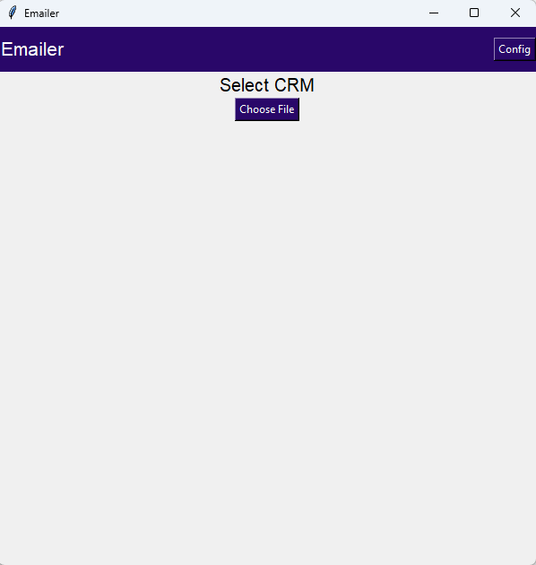
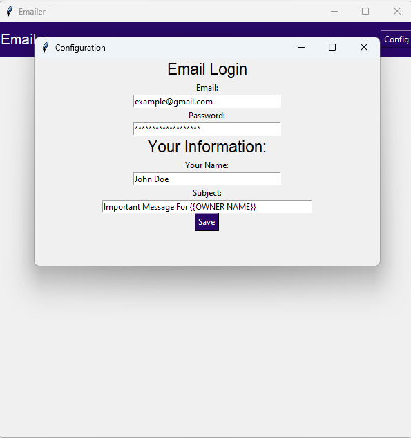
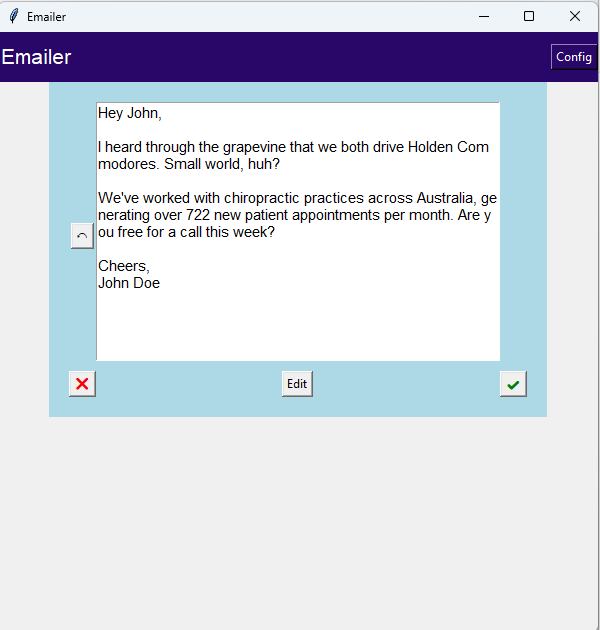

# Python Cold Emailer

## Overview

The Python Cold Emailer is a tool designed for email marketers that uses the OpenAI API to automatically generate personalized cold emails based on CRM data. The tool allows users to configure their email settings, select a CRM file, and send customized emails to multiple recipients.\
This is more so a proof-of-concept than a production-ready solution - tkinter is certainly not an optimal UI solution.

## Features

- Generate personalized emails using the OpenAI API.
- Select and upload a CSV file with CRM data.
- Configure email settings, including email address, password, and subject line.
- Customize email content before sending.
- Simple and user-friendly interface.

## Prerequisites

- Python 3.x
- Required libraries (Install via `requirements.txt`):
  - `tkinter` (for GUI)
  - `smtplib` (for sending emails)
  - `dotenv` (for environment variables)
  - `openai` (for generating email content)
  - `csv` (for reading CRM files)

## Installation

1. Clone this repository to your local machine:
   ```bash
   git clone https://github.com/JW1039/CRM-Emailer.git
   ```

2. Navigate to the project directory:
   ```bash
   cd CRM-Emailer
   ```

3. Install the required dependencies:
   ```
   pip install -r requirements.txt
   ```

4. Set up your `.env` file to store your OpenAI API key:
   ```
   OPENAI_API_KEY=your_openai_api_key
   ```

## Usage

1. **Run the Application**:
   Start the application by running the following command:
   ```bash
   py main.py
   ```

2. **Configure Email Settings**:
   - Click on the **"Config"** button in the top right corner of the main window.
   - Fill in the required information:
     - **Email**: Your email address (e.g., `youremail@example.com`).
     - **Password**: The password for your email account.
     - **Your Name**: Your name (this will be used as the sender's name in the email).
     - **Subject**: The subject line for the emails (supports placeholders like `{{OWNER NAME}}`).

3. **Select CRM File**:
   - In the main interface, click on the **"Choose File"** button.
   - Select a CSV file containing the CRM data. The CSV should have the following columns:
     ```
     Business Name,Email,Owner Name,Custom Message
     ```

   Example CSV:
   ```
   Marks Chiropractors,exampleemail@example.com,Mark Smith,"we both drive Holden Commodores"
   ```

4. **Generate and Send Emails**:
   - After uploading the CRM file, the application will generate personalized emails using the OpenAI API.
   - Review and edit the emails as needed.
   - Click the **Send** button to send all emails.

## CSV Format

The CSV file should contain the following columns:

- **Business Name**: The name of the business you are emailing.
- **Email**: The recipient's email address.
- **Owner Name**: The name of the business owner.
- **Custom Message**: A custom message to include in the email.

Example row:
```
Marks Chiropractors,exampleemail@example.com,Mark Smith,we both drive Holden Commodores
```

## Screenshots

### Main Interface



### Configuration Window



### Email Preview



## License

This project is licensed under the MIT License. See the [LICENSE](LICENSE) file for details.


